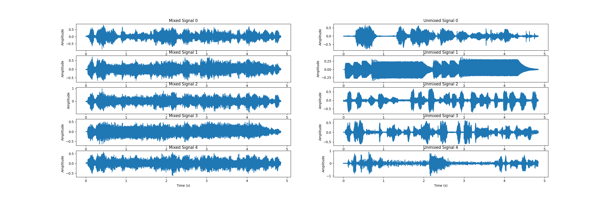

# Independent Component Analysis

This is a python implementation of independent component analysis which is a computational method for separating a multivariate signal into additive subcomponents

In order to use independent component analysis, subcomponents must be **non-Gaussian** signals and they are assumed to be **statistically independent** from each other

Using independent component analysis we can convert mixed audio signals to independent signals which form the mixed signals
